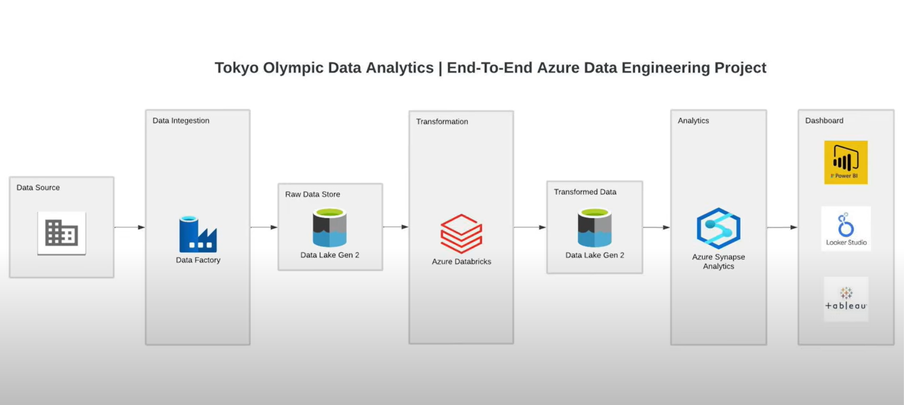

# Tokyo Olympic Data Analytics – End-to-End Azure Data Engineering Project

---

## 📌 Project Overview

This project demonstrates a **complete Data Engineering pipeline** built on **Microsoft Azure** to analyze **Tokyo Olympic data**. It handles data ingestion, storage, transformation, analytics, and dashboarding, providing actionable insights through BI tools.

---

## 🏗️ Architecture Diagram

---

## 🧩 Detailed Process Flow

### **1. Data Source**
- **Input Data**: Tokyo Olympic dataset containing details about countries, athletes, events, and medals.
- Data format: CSV/JSON files.

### **2. Data Ingestion (Azure Data Factory)**
- Orchestrated pipelines to extract raw data from the source.
- Scheduled pipelines to ensure periodic refresh.
- Data validation performed before storage.

### **3. Raw Data Storage (Azure Data Lake Gen 2)**
- Data stored in **Raw Zone** for archival purposes.
- Used as a single source of truth for unprocessed datasets.

### **4. Data Transformation (Azure Databricks)**
- Data cleaning: Handling missing values, duplicates, and formatting inconsistencies.
- Data transformation: Aggregation, normalization, and feature engineering using **PySpark & SQL**.
- Business logic implementation: Medal tally, gender-wise participation, country-wise performance.

### **5. Transformed Data Storage (Azure Data Lake Gen 2)**
- Data moved to **Processed Zone** for downstream analytics.
- Partitioned and structured for faster query performance.

### **6. Data Modeling & Analytics (Azure Synapse Analytics)**
- Created **SQL-based models** for reporting.
- Optimized queries using materialized views and indexing.
- Enabled data exploration for BI tools.

### **7. Visualization & Dashboarding**
- Connected **Power BI, Looker Studio, and Tableau** for interactive dashboards.
- Key visualizations include:
  - Medal tally by country & sport.
  - Participation trends over events.
  - Gender-wise analysis.
  - Top-performing athletes.

---

## ✨ Key Features

- **End-to-end Azure-based ETL pipeline**.
- Scalable architecture with **separate raw & processed layers**.
- **PySpark transformations for big data handling**.
- Integrated with **multiple BI tools** for flexibility.
- Designed for **future expansion (real-time streaming, predictive modeling)**.

---

## 🛠 Tech Stack

- **Azure Data Factory** – Data ingestion & orchestration  
- **Azure Data Lake Gen 2** – Storage (Raw & Processed Zones)  
- **Azure Databricks** – Data transformation using PySpark & SQL  
- **Azure Synapse Analytics** – Analytical modeling & querying  
- **Power BI / Looker Studio / Tableau** – Visualization  

---

## 📊 Use Cases

- Medal tally analysis by country & sport.  
- Tracking athlete performance over time.  
- Identifying top-performing countries.  
- Gender-based participation and medal trends.  

